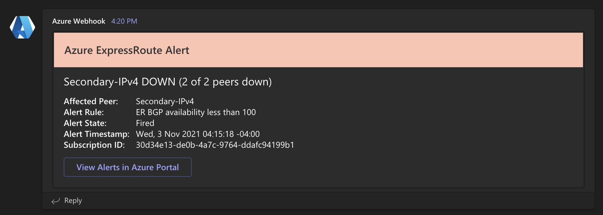

# ct-az-common-alert-endpoint

Azure Function for an HTTP endpoint to receive Azure Monitor alerts that use the Common Alert Schema

| Branch | Status | CI/CD Build Trigger |
| --- | --- | --- |
| `dev` | [](https://github.com/CU-CommunityApps/ct-az-common-alert-endpoint/actions/workflows/dev-build-and-deploy.yml) | Pushes to `dev` branch |
| `main` | [](https://github.com/CU-CommunityApps/ct-az-common-alert-endpoint/actions/workflows/build-and-deploy.yml) | PR to `main` branch |

## :construction: Work and documentation in progress

## Azure Function

### `alertEndpoint`

Accepts alert data from Azure Monitors using the Common Alert Schema - formats alert data
as an [AdaptiveCard](https://adaptivecards.io/explorer/) and then sends it to an
[MS Teams Incoming Webhook](https://docs.microsoft.com/en-us/microsoftteams/platform/webhooks-and-connectors/how-to/add-incoming-webhook)

- Type: HTTP Trigger
- Auth: Anonymous
- Accepts:
  - Method: `POST`
  - Content-Type: `application/json`
  - Schema: `azureMonitorCommonAlertSchema`
    - [Definitions](https://docs.microsoft.com/en-us/azure/azure-monitor/alerts/alerts-common-schema-definitions)
    - [About](https://docs.microsoft.com/en-us/azure/azure-monitor/alerts/alerts-common-schema)
- Currently Supported Alerts
  - Azure Service Health Alert
    - [Schema](https://docs.microsoft.com/en-us/azure/azure-monitor/alerts/alerts-common-schema-definitions#monitoringservice--servicehealth)
    - Details:
      - Gives most important info at a glance
      - Color bar changes based on incident type/stage
      - Buttons to toggle additional details or go to service issues page in Azure Portal
      - HTML in communication converted to Markdown so it displays properly
    - Examples:
      - Collapsed
        
      - Full
        
  - ExpressRoute Platform Alert
    - [Schema](https://docs.microsoft.com/en-us/azure/azure-monitor/alerts/alerts-common-schema-definitions#monitoringservice--platform)
    - Details:
      - Gives most important info at a glance
      - Color bar changes based on alert type and number of peers affected
      - Button to go view the alert in the Azure Portal
    - Additional Notes/Requirements
      - Manages state using a JSON file (kept in Blob Storage inside the Function App's existing storage account)
      - You can specify the blob container (useful for dev vs prod) by setting an environment variable: `BLOB_CONTAINER_NAME`
        - Uses default value of `functions-data` if `BLOB_CONTAINER_NAME` is not provided
    - Examples
      - Primary Down
        
      - Secondary Down
        
      - Primary Up
        
      - Secondary Up
        
  - Application Insights Log Alert (WIP)
    - [Schema](https://docs.microsoft.com/en-us/azure/azure-monitor/alerts/alerts-common-schema-definitions#monitoringservice--application-insights)
    - Details
      - WIP
    - Examples
      - WIP

## GitHub Repo Settings

- **Actions secrets:**
  - **REQUIRED**
    - `AZURE_FUNCTIONAPP_PUBLISH_PROFILE`
      - Publish profile for production function app
    - `AZURE_FUNCTIONAPP_PUBLISH_PROFILE_DEV`
      - Publish profile for dev function app
    - `MS_TEAMS_WEBHOOK_URL`
      - URL of MS Teams Incoming Webhook to be used for deploy notifications
    - `MS_TEAMS_ALERT_WEBHOOK_URL`
      - URL of MS Teams Incoming Webhook to be used for deploy failure notifications (can be same as above)
    - `ACTIONS_STEP_DEBUG`
      - `false` (set to `true` for additional debug output in GitHub Actions logs)
    - `ACTIONS_RUNNER_DEBUG`
      - `false` (set to `true` for additional debug output in GitHub Actions logs)

## Local Development

### Requirements

- Node.js = v16.x
- npm >= v6.x

### Getting Started

1. Clone repo `git clone https://github.com/CU-CommunityApps/ct-az-common-alert-endpoint.git`
1. Enter directory `cd ct-az-common-alert-endpoint`
1. Install dependencies `npm install`
1. Set up environment variables for `MS_TEAMS_WEBHOOK_URL` in `.env` and `local.settings.json`:
   - **REQUIRED**
     - `MS_TEAMS_NOTIFICATION_WEBHOOK_URL`
       - URL of MS Teams Incoming Webhook to be used for informational notifications
     - `MS_TEAMS_ALERT_WEBHOOK_URL`
       - URL of MS Teams Incoming Webhook to be used for actionable alerts (can be same as above)
   - **OPTIONAL**
     - `MS_TEAMS_DEV_WEBHOOK_URL`
       - URL of MS Teams Incoming Webhook to be used for unsupported payloads and development - if not provided, function will fall back to `MS_TEAMS_NOTIFICATION_WEBHOOK_URL`
     - `BLOB_CONTAINER_NAME`
       - Name of the Azure Blob container to use for storing state files - defaults to `functions-data`
     - `LOCAL_DEV`
       - Set to `true` to override alert and notification webhooks during development
       - Make sure to also set up `MS_TEAMS_DEV_WEBHOOK_URL` with a value or it will fall back to `MS_TEAMS_NOTIFICATION_WEBHOOK_URL`
1. Run locally `npm run functions` (for verbose logging use `npm run functions:verbose`)

#### Posting Sample Data Using `curl`

Assumes functions are running locally using instructions above and you are in the root of the repo directory in your terminal

```bash
curl -X POST -H "Content-Type: application/json" --data "@assets/sample-data/service-health-alert.json" http://localhost:7071/api/alertEndpoint
```
